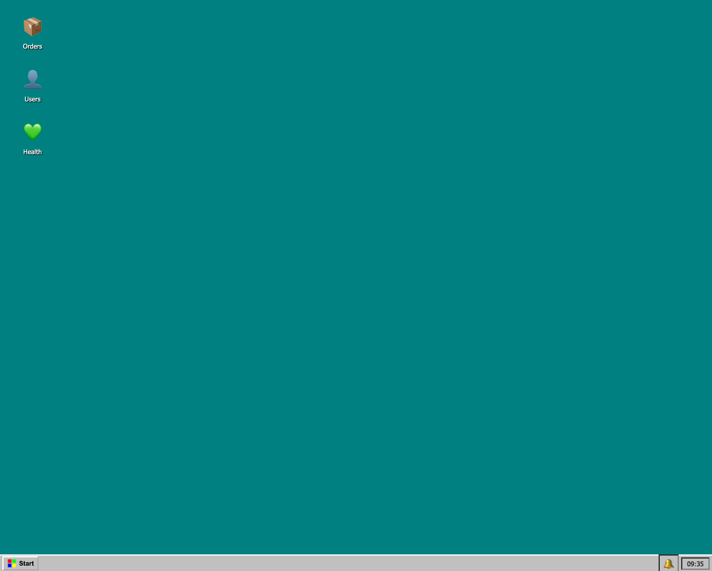
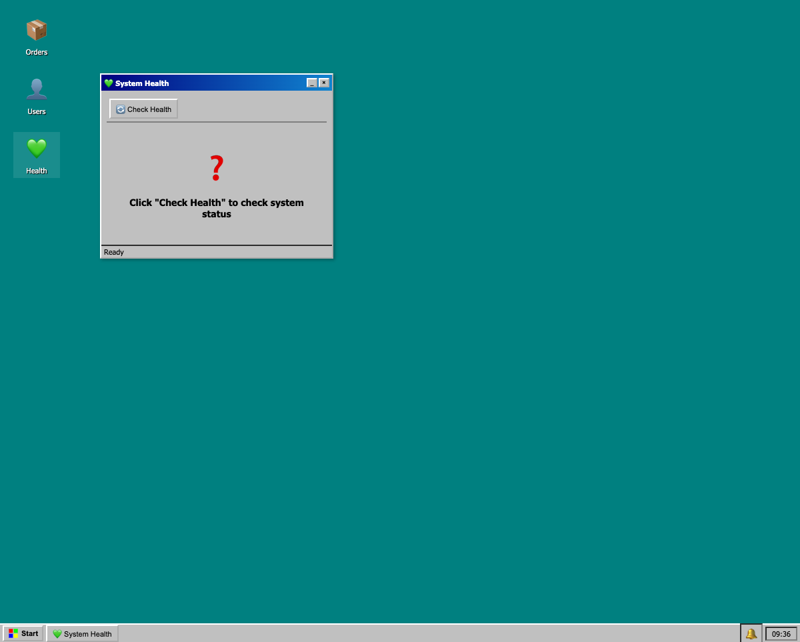
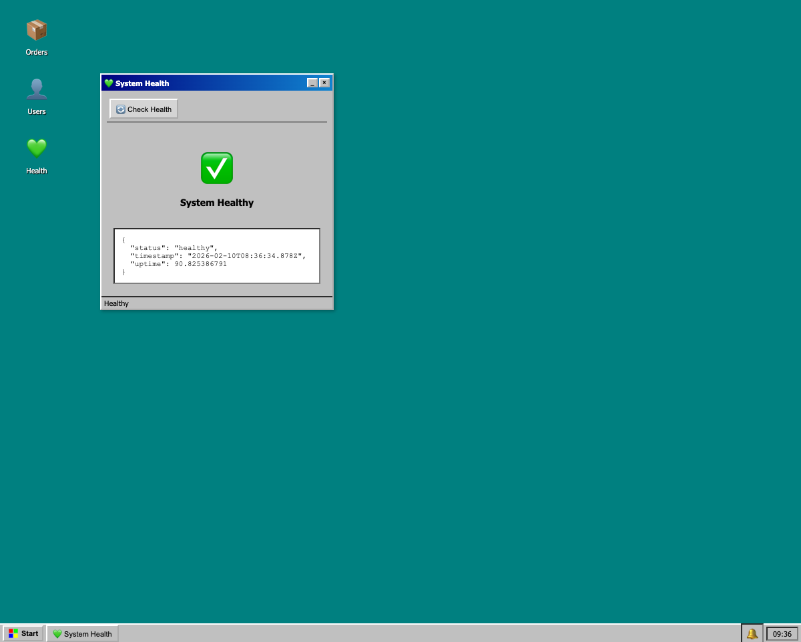

# UI Reverse Engineering Report

## Application Overview

**Win95 Express App** - A Windows 95-themed web application built with Express.js (backend) and vanilla JavaScript (frontend). The application simulates a retro desktop environment with three main features: Orders management, Users management, and System Health checking.

- **Application URL:** http://localhost:3000
- **Technology Stack:** Express.js (TypeScript backend), Vanilla JS frontend, Win95 CSS styling
- **Deployment Mode:** Supports both local server and static GitHub Pages (mock mode)

---

## Health Feature

### Location

- **Desktop Icon:** Left side of desktop, third icon from top
- **Icon Representation:** 💚 (Green Heart emoji)
- **Label:** "Health"
- **Window Title:** "💚 System Health"

### Description

The Health feature provides a system health check functionality that queries the backend API to verify the server is running correctly. It displays:
- Current health status (healthy/error)
- Server timestamp
- Server uptime in seconds

### UI Components

| Component | Type | Description |
|-----------|------|-------------|
| Desktop Icon | Clickable div | 💚 Health - Double-click (or two single clicks) to open |
| System Health Window | Win95-style window | Container with title bar, content area, status bar |
| Title Bar | Header | "💚 System Health" with minimize (_) and close (×) buttons |
| Check Health Button | Button | "🔄 Check Health" - Triggers health check API call |
| Status Indicator | Display area | Shows ❓/⏳/✅/❌ icon with status text |
| Details Panel | Pre-formatted text | Displays raw JSON response from API |
| Status Bar | Footer | Shows current state: "Ready", "Checking health...", "Healthy", "Error" |
| Taskbar Button | Button | "💚 System Health" appears in taskbar when window is open |

### User Flow

1. **Initial State** 
   - Desktop displays three icons: Orders (📦), Users (👤), Health (💚)
   - Taskbar shows Start button, notification area, and clock
   
2. **Open Health Window**
   - Click the "💚 Health" icon on desktop (may require two clicks for Win95-style activation)
   - System Health window appears at default position
   - Window displays: "❓ Click 'Check Health' to check system status"
   - Status bar shows: "Ready"
   - Taskbar now shows "💚 System Health" button

3. **Initiate Health Check**
   - Click the "🔄 Check Health" button
   - Status indicator changes to: "⏳ Checking..."
   - Status bar shows: "Checking health..."

4. **View Results - Success**
   - Status indicator shows: "✅ System Healthy"
   - Details panel displays JSON:
     ```json
     {
       "status": "healthy",
       "timestamp": "2026-02-10T08:36:34.878Z",
       "uptime": 90.825386791
     }
     ```
   - Status bar shows: "Healthy"

5. **View Results - Error** (when server is down)
   - Status indicator shows: "❌ System Error"
   - Status bar shows: "Error"

6. **Close Window**
   - Click "×" button to close, or "_" to minimize
   - Window disappears from screen
   - Taskbar button is removed

### API Endpoints Used

| Method | Endpoint | Description | Response |
|--------|----------|-------------|----------|
| GET | `/api/health` | Check system health status | `{ status: "healthy", timestamp: string, uptime: number }` |

#### API Response Schema

```typescript
interface HealthResponse {
  status: "healthy" | "error";
  timestamp: string;      // ISO 8601 format
  uptime: number;         // Server uptime in seconds
  note?: string;          // Optional, present in mock mode
}
```

#### Backend Implementation ([src/server.ts](src/server.ts#L49-L55))

```typescript
app.get('/api/health', (_req: Request, res: Response) => {
  res.json({
    status: 'healthy',
    timestamp: new Date().toISOString(),
    uptime: process.uptime()
  });
});
```

#### Frontend Implementation ([public/app.js](public/app.js#L580-L597))

```javascript
async function checkHealth() {
  const statusEl = document.getElementById('health-status');
  const indicator = document.getElementById('health-indicator');
  const details = document.getElementById('health-details');
  
  statusEl.textContent = 'Checking health...';
  indicator.innerHTML = '<span class="health-icon">⏳</span><span class="health-text">Checking...</span>';
  
  const result = await apiCall('GET', '/api/health');
  
  if (result.status === 'healthy') {
    indicator.innerHTML = '<span class="health-icon">✅</span><span class="health-text">System Healthy</span>';
    statusEl.textContent = 'Healthy';
    details.textContent = JSON.stringify(result, null, 2);
  } else {
    indicator.innerHTML = '<span class="health-icon">❌</span><span class="health-text">System Error</span>';
    statusEl.textContent = 'Error';
    details.textContent = JSON.stringify(result, null, 2);
  }
}
```

### Screenshots

| Screenshot | Description |
|------------|-------------|
|  | Desktop with Orders, Users, and Health icons |
|  | Health window opened, ready state |
|  | After clicking Check Health - success response |

### Observations

1. **Double-Click Behavior**: The Win95-style desktop requires clicking the icon twice (simulating double-click) to open windows, consistent with Windows 95 UX patterns.

2. **Mock Mode Support**: When deployed statically (e.g., GitHub Pages), the app operates in `MOCK_MODE` which simulates API responses client-side, including health checks with randomized uptime values.

3. **Window Management**: 
   - Windows can be dragged by their title bar
   - Windows have minimize and close buttons
   - Active windows appear in the taskbar
   - Z-index management brings clicked windows to front

4. **Response Time**: Health check API responses are near-instantaneous in local mode (~1-2ms based on network tab observation).

5. **No Error Simulation**: The current implementation always returns "healthy" status - there's no built-in mechanism to simulate an unhealthy state for testing error UI.

6. **Uptime Display**: The uptime value is displayed in seconds as a floating-point number directly from `process.uptime()`, providing high precision but may benefit from human-readable formatting.

---

## Technical Details

### Files Involved

| File | Purpose |
|------|---------|
| [src/server.ts](src/server.ts) | Express server with health endpoint at line 49-55 |
| [public/app.js](public/app.js) | Frontend JavaScript with `checkHealth()` function at line 580 |
| [public/index.html](public/index.html) | HTML structure including health window markup |
| [public/styles.css](public/styles.css) | Win95 styling for health window and components |

### Key DOM Element IDs

- `window-health` - Main health window container
- `health-status` - Status bar text element
- `health-indicator` - Icon and status text display area
- `health-details` - JSON response display area

---

*Report generated: 2026-02-10*
*Reverse engineering performed using Playwright browser automation*
