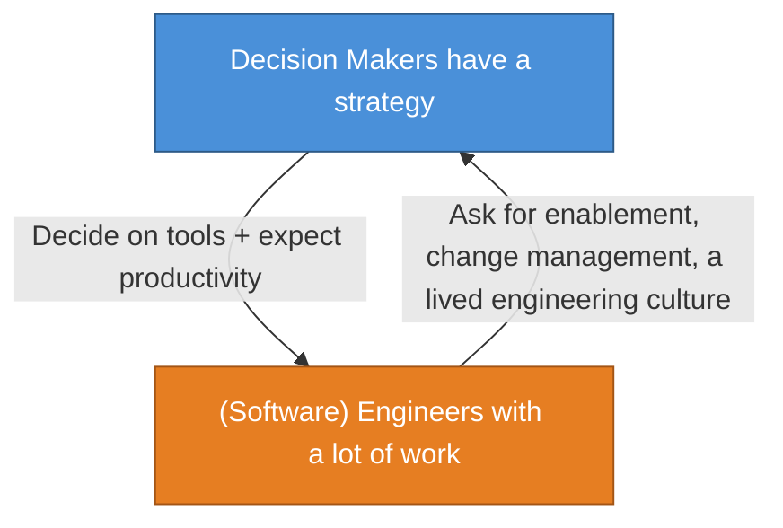

##  Feedback loop from hell

---

### What is the foundational ground work that needs to be in place for a successful application of agentic AI in software development?

1. shared (and written down) understanding about best practices in software engineering and your organization
2. applied guardrails for the use of agentic AI
   - deterministic vs non-deterministic tasks
   - clear boundaries: what AI should *never* do autonomously (e.g., deploy to production, modify security-critical code without review)
   - dont fall intro the trap to try to use agentic AI for something that needs deterministic automation like e.g. CI/CD pipelines, infrastructure as code, etc. 
3. shared prompts/agents for small enough problems that can be solved with agentic AI
4. the right selection of tools to support agentic AI
5. ENABLEMENT
6. testing strategy - automated testing, test coverage expectations, test-driven approaches
7. code review practices, apply the same standards to AI generated and human written code
8. security-by-design - secure coding practices, dependency management
9. observability and auditability - logging, tracing, monitoring, tracking what AI did and why for debugging/compliance
10. context management - ensuring AI has proper access to documentation, architecture decisions, domain knowledge
11. compliance and IP considerations - handling proprietary code with AI tools

### What needs to be done additionally?

1. think about DevEx and Platform Engineering as central enablers for software engineering and agentic AI
2. enable a constant and transparent feedback loop
3. define success metrics, measure them, communicate them transparently (e.g., AI usage costs vs. productivity gains)
4. be brave and flexible to re-think, re-design, re-decide on your strategy, tools, guardrails and best practices
5. human-in-the-loop checkpoints beyond coding: validation gates where humans must verify AI outputs before they reach production
6. failure modes and fallbacks: apply the same for AI and humans
7. incremental adoption - starting with low-risk tasks, expanding as confidence grows
8. technical debt management - how to prevent AI from accelerating debt accumulation
9. skill development paths - how engineers evolve from "writing code" to "orchestrating AI + reviewing outputs"
10. psychological safety - encouraging experimentation without fear of AI "replacing" engineers

### "Unsolved" problems:
1. senior bottleneck: teaching juniors, reviewing code, making architectural decisions
2. the impossibility to become a senior software engineer without going through the process of writing a lot of code, making mistakes, learning from them, and getting feedback from more experienced engineers
3. bridge the communication gap between decision makers and engineers

